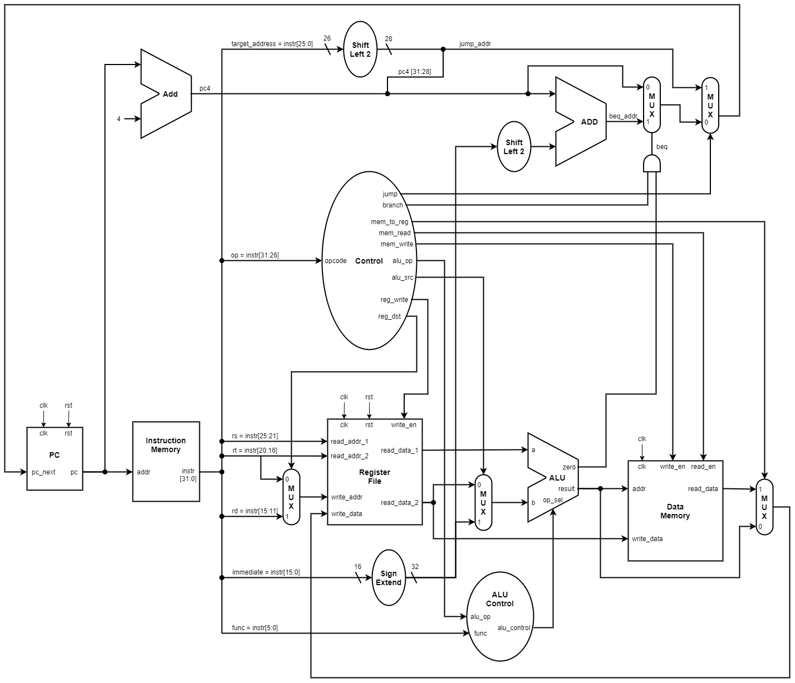

# MIPS-Processor

A 32-bit single-cycle MIPS processor based on the RISC instruction set architecture.

## Architecture

## Instruction Format

<table>
    <thead align=center>
        <tr>
            <td>Field Size</td>
            <td>6 bits</td>
            <td>5 bits</td>
            <td>5 bits</td>
            <td>5 bits</td>
            <td>5 bits</td>
            <td>6 bits</td>
        </tr>
    </thead>
    <tbody align=center>
        <tr>
            <td>R-format</td>
            <td>op</td>
            <td>rs</td>
            <td>rt</td>
            <td>rd</td>
            <td>shamt</td>
            <td>func</td>
        </tr>
        <tr>
            <td>I-format</td>
            <td>op</td>
            <td>rs</td>
            <td>rt</td>
            <td colspan=3>immediate</td>
        </tr>
        <tr>
            <td>J-format</td>
            <td>op</td>
            <td colspan=5>target address</td>
        </tr>
    </tbody>
</table>

## Instructions

| Instruction   | Assembly          | Function                  | Encoding | Op [5:0] | Func [5:0] |
|:-------------:|:-----------------:|:-------------------------:|:--------:|:--------:|:----------:|
| Addition      | add $rs, $rt, $rd | $rd <- $rs + $rt          | R        | 000000   | 100000     |
| Subtraction   | sub $rs, $rt, $rd | $rd <- $rs - $rt          | R        | 000000   | 100010     |
| Bitwise And   | and $rs, $rt, $rd | $rd <- $rs & $rt          | R        | 000000   | 100100     |
| Bitwise Or    | or $rs, $rt, $rd  | $rd <- $rs \| $rt         | R        | 000000   | 100101     |
| Set Less Than | slt $rs, $rt, $rd | $rd <- $rs < $rt          | R        | 000000   | 101010     |
| Load Word     | lw $rt, imm ($rs) | $rt = mem[$rs+imm]        | I        | 100011   | xxxxxx     |
| Store Word    | sw $rt, imm ($rs) | mem[$rs+imm] = $rt        | I        | 101011   | xxxxxx     |
| Branch Equal  | beq $rs, $rt, imm | if ($rs == $rt) go to imm | I        | 000100   | xxxxxx     |
| Jump          | j targ_addr       | go to targ_addr           | J        | 000010   | xxxxxx     |

## Control

| Instruction | Opcode [5:0] | RegDst | RegWrite | ALUSrc | ALUOp [1:0] | MemRead | MemWrite | MemToReg | Jump |
|:-----------:|:------------:|:------:|:--------:|:------:|:-----------:|:-------:|:--------:|:--------:|:----:|
| R-type      | 000000       | 1      | 1        | 0      | 1x          | 0       | 0        | 0        | 0    |
| lw          | 100011       | 0      | 1        | 1      | 00          | 1       | 0        | 1        | 0    |
| sw          | 101011       | x      | 0        | 1      | 00          | 0       | 1        | x        | 0    |
| beq         | 000100       | x      | 0        | 0      | 01          | 0       | 0        | x        | 0    |
| j           | 000010       | x      | 0        | x      | xx          | 0       | 0        | x        | 1    |

## ALU Control

| ALU Operation | ALUOp [1:0] | Func [5:0] | ALUControl[2:0] |
|:-------------:|:-----------:|:----------:|:---------------:|
| + (lw, sw)    | 00          | xxxxxx     | 010             |
| - (beq)       | 01          | xxxxxx     | 110             |
| + (add)       | 1x          | 100000     | 010             |
| - (sub)       | 1x          | 100010     | 110             |
| & (and)       | 1x          | 100100     | 000             |
| \| (or)       | 1x          | 100101     | 001             |
| < (slt)       | 1x          | 101010     | 111             |
